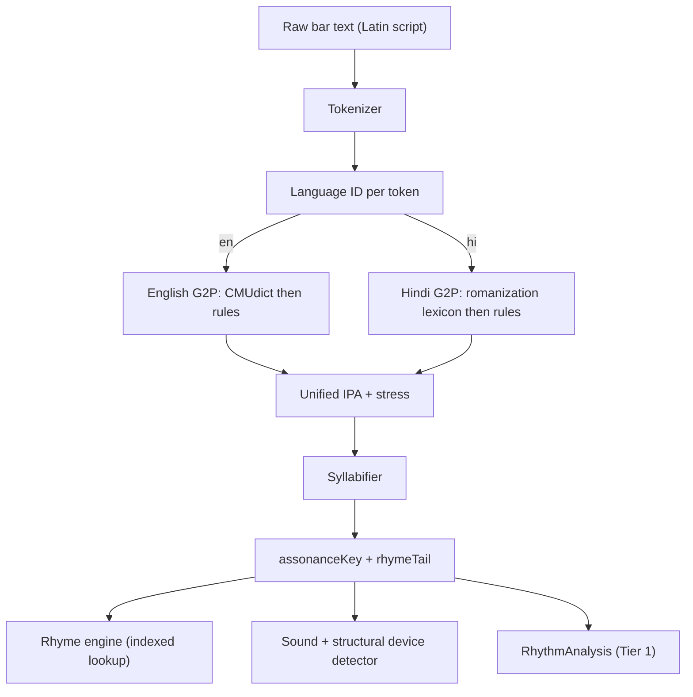
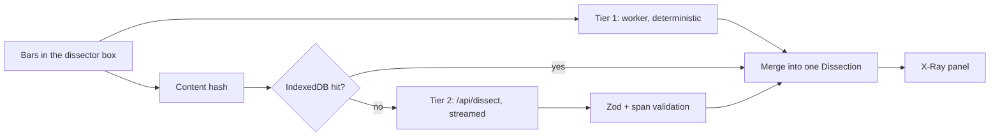
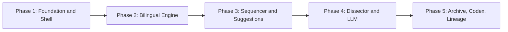

# The Alchemist's Workbench — System Architecture

A DAW for lyrics. Words are rhythmic data, syllables are MIDI notes, and cultural material (NCR geography, corporate grind, Hinglish idiom) is a sample bank.

This document is the single source of truth for the build. It is written to be executed **one phase at a time** — read Section 6, copy the prompt for the phase you are on, and hand it to a coding agent along with this file.

## How to use this document

| Section | Contains |
| --- | --- |
| 1 | Core data model — sequencer, lyric nodes, lineage, archive, store slices |
| 2 | The knowledge layer — literary device taxonomy and track musicology |
| 3 | The bilingual engine — Hinglish tokenizing, G2P, unified IPA, rhyme scoring |
| 4 | The bar dissector — two-tier analysis pipeline and API contracts |
| 5 | Directory and component tree with Server/Client boundaries |
| 6 | Phase-by-phase execution plan with agent-ready prompts |
| A–F | Appendices — design tokens, dependencies, device checklist, lexicon spec, IPA tables, mock data staging |

## Governing principle

**Anything objectively checkable is computed deterministically. The LLM is only allowed to interpret.**

Syllable counts, stress patterns, vowel sequences, rhyme classification, rhyme scoring, and sound-device spans come from code in `lib/engine/`. Meaning, entendre, cultural reference, and the "why" come from the model, constrained to a fixed device vocabulary and validated before it reaches the UI.

This split is what separates this app from a chat wrapper. It also means the entire writing surface works offline with no API key — the model adds interpretation, never correctness.

## Non-negotiable stack

- Next.js 14 (App Router), TypeScript strict mode
- Tailwind CSS + Shadcn UI
- Zustand with `immer` + `persist` middleware
- Framer Motion for all interaction feedback
- React Flow for node graphs (lineage map and sample lineage)
- dnd-kit for syllable manipulation
- Zod for every API boundary
- Vitest for the engine's test suite

Input is **Latin script only**. Both English and romanized Hindi are typed on a standard keyboard; there is no Devanagari input path anywhere in the app.

---

# Section 1: Core Data Model

All types live under `lib/types/` and are re-exported from `lib/types/index.ts`. Nothing in `components/` may define a domain type.

## 1.1 Design decisions worth defending

**Sequencer state is normalized.** Syllables live in a `Record<string, LyricNode>` and the grid holds only ids in a fixed-length positional array. dnd-kit requires stable string ids for draggables and droppables, and with this shape moving a syllable is two array writes instead of a nested splice. A nested `bars[bar].beats[beat].ticks[tick]` structure would make every drag an immutable deep-clone and every lookup a three-level walk.

**A 4-bar loop is exactly 64 slots.** 4 bars x 4 beats x 4 sixteenth-notes. `slotIndex` is the single source of truth; `bar`, `beat`, and `tick` are always derived:

```ts
// lib/engine/grid.ts
export const SLOT_COUNT = 64;
export const toSlotIndex = (bar: number, beat: number, tick: number) => bar * 16 + beat * 4 + tick;
export const fromSlotIndex = (i: number) => ({ bar: (i / 16) | 0, beat: ((i % 16) / 4) | 0, tick: i % 4 });
```

**Accent is derived, never stored.** Storing it would let it drift out of sync with position:

```ts
export type SlotAccent = 'downbeat' | 'eighth' | 'syncopated';
export const accentFor = (slotIndex: number): SlotAccent => {
  const tick = slotIndex % 4;
  if (tick === 0) return 'downbeat';    // bright glow
  if (tick === 2) return 'eighth';      // neutral
  return 'syncopated';                  // amber
};
```

**Language is tracked per token, not per document.** A single bar routinely code-switches mid-line ("deployed the fix, phir bhi client naaraaz"). Any type that carries text also carries its language and the confidence behind that call.

## 1.2 Phonetic primitives

```ts
// lib/types/phonetics.ts

/** Both languages are typed in Latin script; this is the *phonology* being invoked. */
export type Lang = 'en' | 'hi';

export type Stress = 0 | 1 | 2; // 0 unstressed, 1 primary, 2 secondary

export interface Phoneme {
  /** Unified IPA inventory — the bridge that makes cross-language rhyme possible. See Appendix E. */
  ipa: string;
  kind: 'vowel' | 'consonant';
  /** Contrastive in Hindi (kal /kəl/ vs kaal /kaːl/) and load-bearing for rhyme scoring. */
  length: 'short' | 'long';
  stress: Stress;
  /** Hindi nasalization (maiṁ, hooṁ) — affects rhyme tail matching. */
  nasalized?: boolean;
}

export interface Syllable {
  onset: Phoneme[];
  nucleus: Phoneme;      // exactly one vowel per syllable, by definition
  coda: Phoneme[];
  stress: Stress;
  /** Substring of the source token this syllable covers, for span highlighting. */
  graphemes: string;
}

/**
 * A single pronunciation hypothesis. Romanized Hindi is lossy, so the G2P
 * returns a ranked list of these rather than one answer.
 */
export interface Pronunciation {
  phonemes: Phoneme[];
  syllables: Syllable[];
  /** Vowel-nucleus sequence, e.g. 'aː_iː'. The join key for assonance and the rhyme index. */
  assonanceKey: string;
  /** From the last primary-stressed nucleus to the end. What "rhyme" actually compares. */
  rhymeTail: string;
  score: number;                             // lexicon hit > rules hit
  origin: 'lexicon' | 'rules' | 'user';
}

export interface TokenAnalysis {
  token: string;
  /** Character offsets into the source line, so every readout can highlight exact text. */
  charStart: number;
  charEnd: number;
  lang: Lang;
  langConfidence: number;                    // 0-1
  langLocked: boolean;                       // true once the user overrides
  /** Ranked; candidates[0] is used unless the user picks another. */
  candidates: Pronunciation[];
  selectedCandidate: number;
}
```

## 1.3 LyricNode — a syllable as a placeable object

```ts
// lib/types/lyric.ts
import type { Lang, Phoneme, Stress } from './phonetics';

export interface LyricNode {
  id: string;                   // nanoid; stable dnd-kit draggable id
  text: string;                 // 'Da'
  wordId: string;               // 'Data' -> its two nodes share this
  indexInWord: number;
  lang: Lang;
  langConfidence: number;
  langLocked: boolean;
  phonemes: Phoneme[];
  assonanceKey: string;
  stress: Stress;
  /** null = still in the tray, not yet placed on the grid. */
  slotIndex: number | null;
  /** Rhyme-scheme colour coding; assigned by the engine, overridable by hand. */
  rhymeGroupId: string | null;
  /** 0-1 velocity. Drives glow intensity — a placed syllable can be hit soft or hard. */
  emphasis: number;
  source: 'typed' | 'template' | 'llm';
}
```

## 1.4 SequencerGrid

```ts
// lib/types/sequencer.ts
import type { LyricNode } from './lyric';

export interface SequencerGrid {
  id: string;
  title: string;
  bpm: number;
  bars: 4;
  beatsPerBar: 4;
  ticksPerBeat: 4;              // literal types: the grid is always 64 slots
  /** Length 64. Index is slotIndex, value is a LyricNode id or null. */
  slots: (string | null)[];
  nodes: Record<string, LyricNode>;
  /** Ordered ids of syllables not yet placed. */
  tray: string[];
  activeTemplateId: string | null;
  playheadSlot: number | null;
  isPlaying: boolean;
  /** Set when a Lineage technique template was loaded, for the "clear template" affordance. */
  loadedFrom: { artistId: string; techniqueId: string } | null;
}
```

Invariants the store must maintain, stated so the agent can assert them in tests:

1. `slots.length === 64` always.
2. A node id appears in `slots` at most once, and never in both `slots` and `tray`.
3. Every id in `slots` and `tray` exists as a key in `nodes`.
4. `nodes[id].slotIndex` agrees with the node's position in `slots`.

## 1.5 Lineage

```ts
// lib/types/lineage.ts
import type { Node, Edge } from '@xyflow/react';

export interface SequencerTemplate {
  id: string;
  name: string;
  bpm: number;
  placements: {
    slotIndex: number;
    text: string;
    assonanceKey: string;
    emphasis: number;
  }[];
}

export interface TechniqueModule {
  id: string;
  name: string;                 // 'Mosaic Rhyme', 'Soul-Sample Cadence'
  description: string;
  /** What to listen for; shown in the drawer before the user loads it. */
  listenFor: string;
  template: SequencerTemplate;  // loaded straight into SequencerGrid
}

export interface LineageArtist {
  id: string;
  name: string;
  era: '80s' | '90s' | '2000s' | '2010s' | '2020s';
  yearsActive: [number, number | null];
  region: string;
  /** One line: what this artist structurally changed about rap. */
  thesis: string;
  influencedBy: string[];       // artist ids -> React Flow edges
  techniques: TechniqueModule[];
  archiveArtistId: string | null;
  accentColor: string;          // Tailwind token, drives node border + glow
}

/** React Flow generics, so node.data is typed at every callsite. */
export type LineageFlowNode = Node<LineageArtist, 'artistNode'>;
export type LineageFlowEdge = Edge<{ relation: 'direct' | 'sample' | 'regional' }>;
```

## 1.6 Archive and dissection

The critical property: **a dissection of a Kendrick line and a dissection of a bar you just typed are the same type.** The X-Ray panel cannot tell them apart, which is what makes the study module and the writing tool one app instead of two.

```ts
// lib/types/archive.ts
import type { DeviceInstance } from './devices';
import type { TrackProduction } from './production';
import type { Lang, TokenAnalysis } from './phonetics';

export interface ArchiveArtist {
  id: string;
  name: string;
  aka: string[];
  origin: string;
  activeSince: number;
  /** Why they matter technically, not biographically. */
  thesis: string;
  albums: Album[];
  accentColor: string;
}

export interface Album {
  id: string;
  title: string;
  year: number;
  kind: 'album' | 'mixtape' | 'ep' | 'compilation';
  label: string;
  tracks: Track[];
}

export interface Track {
  id: string;
  title: string;
  trackNumber: number;
  features: string[];
  /** Present only for the fully dissected reference song per artist. */
  lyrics?: LyricLine[];
  production?: TrackProduction;
  isReference: boolean;
}

export interface LyricLine {
  id: string;
  /** Bar index within the song, so 4-bar blocks can be selected as a unit. */
  barIndex: number;
  sectionId: string;
  text: string;
  /** Dominant language of the line; individual tokens may differ. */
  lang: Lang;
  dissection: Dissection | null;
}

export interface Entendre {
  reading: string;
  layer: 'literal' | 'figurative' | 'cultural' | 'meta';
  /** Span within LyricLine.text that carries this reading. */
  charStart: number;
  charEnd: number;
}

/** Tier 1 output — every field here is computed, never generated. */
export interface RhythmAnalysis {
  syllableCount: number;
  tokens: TokenAnalysis[];
  /** Rhyme-scheme letter for the line end, e.g. 'A'. */
  schemeLetter: string;
  internalRhymes: { aSpan: [number, number]; bSpan: [number, number]; score: number }[];
  assonanceChains: { key: string; spans: [number, number][] }[];
  /** Syllables per bar — the objective measure of "dense" vs "spacious". */
  density: number;
  /** Where the syllables actually land against the grid. */
  slotMap: (string | null)[];
  pocket: 'ahead' | 'in' | 'behind' | 'mixed';
  articulation: 'staccato' | 'legato' | 'mixed';
}

export interface Dissection {
  lineId: string;
  /** Tier 1, deterministic. Always present, even with no API key. */
  rhythm: RhythmAnalysis;
  /** Tier 2, interpretive. Null until generated or authored. */
  meaning: string | null;
  entendres: Entendre[];
  flowMechanics: string | null;
  rhymeScience: string | null;
  why: string | null;
  devices: DeviceInstance[];
  provenance: 'authored' | 'engine' | 'engine+llm';
  schemaVersion: number;
  generatedAt: string | null;
}
```

## 1.7 Reality Flipper and Phonetic Matrix

```ts
// lib/types/reality.ts
export interface RealityEntry {
  id: string;
  createdAt: string;
  /** Unstructured life input: commutes, failed migrations, burnout. */
  body: string;
  tags: string[];               // 'work', 'commute', 'family', 'money', 'ex'
  mood: 'flat' | 'wired' | 'bitter' | 'hollow' | 'defiant';
}

export interface ExtractionResult {
  id: string;
  sourceEntryId: string;
  sourceSpan: [number, number];
  kind: 'metaphor' | 'muhawara' | 'pocket-skeleton' | 'image';
  /** The suggestion itself. */
  output: string;
  /** For muhawara: the idiom, its literal gloss, and its figurative use. */
  gloss?: string;
  literal?: string;
  /** For pocket-skeleton: a template the sequencer can load directly. */
  templateId?: string;
  accepted: boolean;
}
```

```ts
// lib/types/matrix.ts
import type { Lang } from './phonetics';

export interface MatrixFilter {
  langs: Lang[];
  /** The Desi/pop-culture toggle from the PRD, generalized to tag filters. */
  tags: string[];               // 'ncr', 'tech', 'filmi', 'slang'
  minScore: number;
  syllableCount: number | null;
  crossLanguageOnly: boolean;
}

export interface AssonanceColumn {
  /** The vowel structure this column represents, e.g. 'aː_iː'. */
  key: string;
  /** Human-readable, e.g. 'AA - EE'. */
  label: string;
  entries: { text: string; lang: Lang; tags: string[]; score: number }[];
}
```

## 1.8 Store shape

One store, seven slices, composed in `lib/store/index.ts`. Slices are created with the standard Zustand slice pattern so each file stays independently testable.

```ts
// lib/store/index.ts
export type WorkbenchStore =
  SequencerSlice & RealitySlice & EngineSlice & DissectSlice & CodexSlice & ArchiveSlice & UiSlice;

export const useWorkbenchStore = create<WorkbenchStore>()(
  persist(
    immer((...a) => ({
      ...createSequencerSlice(...a),
      ...createRealitySlice(...a),
      ...createEngineSlice(...a),
      ...createDissectSlice(...a),
      ...createCodexSlice(...a),
      ...createArchiveSlice(...a),
      ...createUiSlice(...a),
    })),
    {
      name: 'alchemists-workbench',
      version: 1,
      /** Persist user work only. Lexicons, indexes, and archive data are code, not state. */
      partialize: (s) => ({
        grids: s.grids,
        activeGridId: s.activeGridId,
        entries: s.entries,
        extractions: s.extractions,
        langOverrides: s.langOverrides,
        pronunciationOverrides: s.pronunciationOverrides,
        mastery: s.mastery,
        userDissections: s.userDissections,
        ui: { theme: s.theme, sidebarCollapsed: s.sidebarCollapsed },
      }),
    },
  ),
);
```

Slice responsibilities and their action surfaces:

```ts
// lib/store/sequencer-slice.ts
export interface SequencerSlice {
  grids: Record<string, SequencerGrid>;
  activeGridId: string;
  selectedNodeIds: string[];

  ingestText(text: string): void;              // tokenize -> syllabify -> fill tray
  placeNode(nodeId: string, slotIndex: number): void;
  moveNode(nodeId: string, toSlotIndex: number): void;
  returnToTray(nodeId: string): void;
  clearSlot(slotIndex: number): void;
  setEmphasis(nodeId: string, emphasis: number): void;
  setRhymeGroup(nodeId: string, groupId: string | null): void;
  loadTemplate(template: SequencerTemplate, from: { artistId: string; techniqueId: string }): void;
  setBpm(bpm: number): void;
  transport: { play(): void; pause(): void; stop(): void; setPlayhead(slot: number | null): void };
}
```

```ts
// lib/store/engine-slice.ts
/** Owns the worker handle and every analysis result. No component talks to the worker directly. */
export interface EngineSlice {
  workerReady: boolean;
  indexLoaded: boolean;
  analysis: Record<string, TokenAnalysis[]>;   // keyed by line id
  rhymes: Record<string, RhymeCandidate[]>;   // keyed by query token id
  /** Sticky user corrections, persisted. Token text -> language. */
  langOverrides: Record<string, Lang>;
  /** Token text -> chosen candidate index. */
  pronunciationOverrides: Record<string, number>;

  initWorker(): Promise<void>;
  analyzeLine(lineId: string, text: string): Promise<void>;
  requestRhymes(tokenId: string, token: string, filter: MatrixFilter): Promise<void>;
  overrideLang(token: string, lang: Lang): void;
  overridePronunciation(token: string, candidateIndex: number): void;
}
```

```ts
// lib/store/dissect-slice.ts
export interface DissectSlice {
  draft: string;                                  // the bars in the dissector box
  userDissections: Record<string, Dissection>;    // keyed by content hash
  status: 'idle' | 'tier1' | 'streaming' | 'done' | 'degraded' | 'error';
  interpretiveAvailable: boolean;                 // false when no API key

  setDraft(text: string): void;
  runTierOne(): Promise<void>;                    // worker, instant, offline
  runTierTwo(): Promise<void>;                    // /api/dissect, streamed
  cancel(): void;
}
```

```ts
// lib/store/codex-slice.ts
export interface CodexSlice {
  familyFilter: DeviceFamily[];
  depthFilter: DeviceDepth[];
  lensEnabled: boolean;                           // overlay all device spans at once
  hoveredDeviceId: string | null;
  /** Mastery tracking, persisted: what you've seen and what you've practiced. */
  mastery: Record<string, { seen: number; practiced: number; lastSeenAt: string }>;

  toggleFamily(f: DeviceFamily): void;
  toggleDepth(d: DeviceDepth): void;
  toggleLens(): void;
  hoverDevice(id: string | null): void;
  markSeen(deviceId: string): void;
  practiceDevice(deviceId: string): void;         // loads template into sequencer
}
```

`RealitySlice` holds entries, extractions, and the highlight-to-extract selection state. `ArchiveSlice` holds only navigation and X-Ray selection (`selectedLineIds`, `selectedBlockRange`) — the catalogue itself is static module data, never copied into the store. `UiSlice` holds theme, sidebar state, and the active command-palette target.

---

# Section 2: The Knowledge Layer

This is what makes the app a teacher rather than a reader. Two type families: literary devices as first-class data, and per-track musicology.

## 2.1 Devices as data, not prose

A dissection that says "great use of extended metaphor here" is a dead end. You cannot filter it, count it, or practice it. So the taxonomy is a standalone dataset in `lib/mock/devices.ts`, independent of any song, and lines reference devices by id plus a character span.

```ts
// lib/types/devices.ts

export type DeviceFamily =
  | 'sound'        // assonance, consonance, internal rhyme, mosaic, holorime
  | 'figurative'   // metaphor, metonymy, synecdoche, conceit, litotes
  | 'structural'   // anaphora, epistrophe, chiasmus, enjambment, caesura, volta
  | 'wordplay'     // entendres, homophone puns, zeugma, paraprosdokian
  | 'cultural';    // signifyin', braggadocio, the dozens, code-switching, flips

/** How deep you have to be looking to notice it. Drives the "small or deep or big" filter. */
export type DeviceDepth = 'surface' | 'craft' | 'esoteric';

export interface LiteraryDevice {
  id: string;                   // 'extended-metaphor', kebab-case, stable forever
  name: string;
  family: DeviceFamily;
  depth: DeviceDepth;
  /** Technical definition, using the real terminology. */
  definition: string;
  /** One line, no jargon. Shown first; the technical definition is a disclosure. */
  plainDefinition: string;
  canonicalExample: {
    text: string;
    attribution: string;
    /** Why this example is the canonical one — what to notice. */
    note: string;
  };
  relatedDeviceIds: string[];
  /** Non-null means "Practice this device" appears, loading this into the sequencer. */
  practiceTemplateId: string | null;
  /**
   * True if lib/engine/detect-devices.ts can find it with certainty.
   * False means it is LLM territory and always renders as arguable.
   */
  detectable: boolean;
  /** Devices that only apply to bilingual writing, e.g. cross-language slant rhyme. */
  bilingualOnly?: boolean;
}

export interface DeviceInstance {
  deviceId: string;
  /** Span within the line's text. This is what enables hover-to-highlight. */
  charStart: number;
  charEnd: number;
  /** Why *this* text is *that* device. Never a restatement of the definition. */
  explanation: string;
  detectedBy: 'engine' | 'llm' | 'author';
  confidence: 'certain' | 'arguable';
}
```

The `detectable` flag is the honesty mechanism. Sound and structural devices are found by code and render as certain. Figurative, wordplay, and cultural devices are interpretation and render as arguable, visually distinguished so you always know which claims are computed and which are opinion. The full 81-entry checklist with family, depth, and detectability is in **Appendix C**.

## 2.2 The reverse index

The inventory needs to answer "show me every line in the archive that uses this device". That is a derived structure, computed once at module load from the annotations, never stored:

```ts
// lib/codex/device-index.ts
export interface DeviceOccurrence {
  artistId: string;
  artistName: string;
  trackId: string;
  trackTitle: string;
  lineId: string;
  snippet: string;              // the highlighted span in context
  confidence: 'certain' | 'arguable';
}

export type DeviceIndex = Record<string, DeviceOccurrence[]>;

/** Built by walking every ArchiveArtist -> Album -> Track -> LyricLine -> devices. */
export const deviceIndex: DeviceIndex = buildDeviceIndex(artists);
export const deviceCounts: Record<string, number> = /* derived from deviceIndex */;
```

Because this runs at module scope in a Server Component context, `/codex` renders occurrence counts with zero client-side work and zero network calls.

## 2.3 Musicology per track

Studying rap without studying the beat is studying half of it. Every reference track carries a full production record.

```ts
// lib/types/production.ts

export interface GenreWeight {
  genre: string;                // 'boom bap', 'jazz', 'gospel', 'trap', 'psych rock'
  weight: number;               // 0-1, weights sum to 1
  /** What specifically comes from this genre — instrument, rhythm, or texture. */
  contribution: string;
}

export interface SampleSource {
  id: string;
  title: string;
  artist: string;
  year: number;
  genre: string;
  flipType: 'chop' | 'loop' | 'pitch-shift' | 'interpolation' | 'replay';
  /** Exactly what was taken: 'the four-bar horn stab', 'the vocal ad-lib'. */
  whatWasTaken: string;
  timestampInOriginal?: string;
  /** Samples can themselves sample — this makes the graph a graph, not a list. */
  sampledFrom?: string[];
}

export interface SongSection {
  id: string;
  kind: 'intro' | 'verse' | 'pre' | 'hook' | 'bridge' | 'outro' | 'skit';
  label: string;                // 'Verse 2'
  startBar: number;
  endBar: number;
  lineIds: string[];            // aligns the lyric column to song structure
  /** Where the beat changes under the same verse — flow switches usually land here. */
  beatSwitch?: boolean;
}

export interface TrackProduction {
  producers: string[];
  bpm: number;
  musicalKey: string;           // 'F# minor'
  timeSignature: string;        // '4/4'
  /** Rendered as an interactive stacked bar, not a sentence. */
  genreBlend: GenreWeight[];
  samples: SampleSource[];
  drumPalette: string[];        // '808', 'live kit', 'SP-1200 swing', 'no snare'
  instrumentation: string[];
  /** 'dry vocal, heavy sidechain, no reverb tail' — how the record was mixed. */
  mixCharacter: string;
  /** What was happening in rap production that year, so the choices have context. */
  eraContext: string;
  sections: SongSection[];
  /** How the rapping sits against the drums, tying the archive back to the sequencer. */
  vocalPlacement: string;
}
```

Reuse note: `SampleGraph` renders with the same custom React Flow node and edge components as `/lineage`, parameterised by node kind (`artistNode` vs `sampleNode`). Building the lineage map first means the sample graph is close to free.

## 2.4 Interactivity contract

The data model above only pays off if the UI is wired to it precisely. These behaviours are requirements, not suggestions:

- **Hover a device chip** — its span highlights in the lyric column via `hoveredDeviceId` in the codex slice. Highlight is a Framer Motion background transition, not a class toggle.
- **Click a device chip** — routes to `/codex/[deviceId]` with the occurrence list, definition, and canonical example.
- **Device lens** — a toggle that overlays every annotation in the current view at once, colour-coded by family, filterable by family and depth. This is the "show me everything, even the small stuff" mode.
- **Certainty is visible** — `certain` spans get a solid underline, `arguable` spans get a dotted one. You should never have to guess whether the app computed something or inferred it.
- **Practice this device** — loads `practiceTemplateId` into the Syllable Sequencer and increments `mastery[deviceId].practiced`. This closes the loop between studying a technique and using it, and it is the single most important interaction in the knowledge layer.
- **Genre blend** — clicking a genre segment filters the sample graph to the samples contributing that genre.
- **Arrangement rail** — scrolling the lyric column moves a marker along the section rail; clicking a section scrolls to its first line.

---

# Section 3: The Bilingual Engine

This is the hardest part of the build and the part everything else depends on. It is headless, test-first, and runs entirely in a web worker. No React, no DOM, no network.

## 3.1 The pipeline



## 3.2 The Hinglish problem

Because input is romanized only, English and Hindi arrive in the same alphabet and the tokenizer must decide **per token** which phonology to apply. This is not a corner case — it is most lines. Ambiguous tokens are extremely common and often function words:

| Token | As English | As Hindi |
| --- | --- | --- |
| `main` | main (principal) | maiṁ (I) |
| `to` | to | toh (so/then) |
| `bat` | bat | baat (matter/talk) |
| `sab` | sab (rare) | sab (everyone) |
| `car` | car | kar (do) |
| `mere` | mere (as in unadorned) | mere (my) |
| `is` | is | is (this, oblique) |
| `dil` | — | dil (heart) |
| `kal` | — | kal (yesterday/tomorrow) |

Getting this wrong is not cosmetic: it changes the vowel inventory, which changes the rhyme tail, which changes every suggestion downstream.

### Language ID as a scored decision

`lib/engine/language-id.ts` scores each token rather than guessing:

```ts
export interface LangScore { lang: Lang; score: number; reasons: string[] }

/**
 * Weighted evidence, computed independently then combined:
 *  1. Lexicon priors     (0.45) — unigram frequency in an English corpus vs a Hinglish corpus
 *  2. Orthographic cues  (0.25) — spelling patterns that only occur in one language
 *  3. Context smoothing  (0.20) — code-switching is bursty; neighbours predict each other
 *  4. Morphology         (0.10) — Hindi postposition and inflection suffixes
 */
export function identifyLanguage(tokens: string[], overrides: Record<string, Lang>): LangScore[];
```

Orthographic cues that skew Hindi: doubled vowels (`aa`, `ee`, `oo`), aspirate digraphs in non-English positions (`kh`, `gh`, `bh`, `dh`, `jh`, `ch` word-finally), retroflex-suggesting clusters, and word-final `-ne`, `-ka`, `-ki`, `-ko`, `-se`, `-mein`, `-wala`. Cues that skew English: consonant clusters illegal in Hindi onsets (`str`, `spl`, `thr`), silent-`e` patterns, and `-tion`, `-ing`, `-ly`, `-ment` suffixes.

Context smoothing matters because code-switching happens in runs, not alternating words. Implement it as a two-pass: score tokens independently, then apply a light left-right smoothing where a token's confidence below a threshold is nudged toward the language of its immediate neighbours. Do not over-smooth — a single English tech term dropped into a Hindi clause is exactly the kind of line this user writes.

### The override is a first-class feature

Every token renders with a small language badge. One click flips it. That sets `langLocked` on the node, writes to `langOverrides` in the engine slice, and persists — so the app converges on **your** spelling habits over time. This is why `langOverrides` is keyed by token text rather than by node id.

## 3.3 English G2P

`lib/engine/g2p-en.ts`:

1. **CMUdict lookup.** ARPABET phonemes with stress digits. Convert to the unified IPA inventory via the mapping table in Appendix E. Multiple dictionary entries become multiple `Pronunciation` candidates.
2. **Rules fallback for out-of-vocabulary tokens** — slang, names, neologisms, and deliberate misspellings, all of which are constant in rap. A grapheme-to-phoneme rule cascade with longest-match-first digraph handling, plus a stress heuristic (default penultimate for polysyllables, initial for disyllabic nouns).
3. **Origin marking.** Lexicon hits score higher than rules hits, which is what ranks the candidate list.

The dictionary is loaded in the worker, not the main bundle. See the size budget in 3.10.

## 3.4 Romanized Hindi G2P

`lib/engine/g2p-hi.ts`. Romanization is lossy in ways that matter for rhyme:

| Spelling | Possible phonemes | Example collision |
| --- | --- | --- |
| `a` | /ə/ or /aː/ | kal = कल /kəl/ or काल /kaːl/ |
| `i` | /ɪ/ or /iː/ | din /dɪn/ vs dii /diː/ |
| `u` | /ʊ/ or /uː/ | dur /d̪uːr/ vs dukh /d̪ʊkʰ/ |
| `e` | /eː/ or /ɛː/ | mel /meːl/ vs mehnat /mɛːɦnət̪/ |
| `o` | /oː/ or /ɔː/ | mor /moːr/ vs aur /ɔːr/ |
| `ai` | /ɛː/ or /aɪ/ | hai /hɛː/ vs English-style /aɪ/ |
| `t` / `d` | dental /t̪ d̪/ or retroflex /ʈ ɖ/ | tum /t̪ʊm/ vs tapak /ʈəpək/ |
| `th` | /t̪ʰ/, /ʈʰ/, or English /θ/ | thoda /t̪ʰoːɽaː/ vs "thought" |
| `ph` | /pʰ/ or /f/ | phir /pʰɪr/ vs phone |
| `sh` | /ʃ/ or /ʂ/ | shaam vs kashṭ |
| `n` | /n/, /ɳ/, or nasalization | main → /mɛ̃ː/ |

Therefore the G2P **returns ranked candidates, never one answer**:

1. **Lexicon first.** A curated romanization lexicon maps spelling variants to a canonical entry with known phonemes. `dil`, `dill`, `dill'` all resolve to /d̪ɪl/. This resolves the overwhelming majority of real input.
2. **Rules for the tail.** Longest-match digraph transliteration into the unified inventory, generating candidates for each ambiguous grapheme, capped and pruned by a plausibility score so the candidate list stays small.
3. **Schwa deletion.** The single biggest correctness risk in Hindi phonetics, applied after transliteration:
   - Word-final schwa always deletes — `kamal` is /kəməl/, never /kəmələ/.
   - Medial schwa deletes in a `VC_CV` context, applied right to left.
   - Never delete a word-initial schwa.
   - Never create a consonant cluster that Hindi phonotactics disallow; if deletion would, keep the schwa.
   Get this wrong and syllable counts are wrong, which corrupts every rhythm readout.
4. **Nasalization.** Word-final and pre-consonantal `n`/`m` in Hindi tokens become a nasalization feature on the preceding vowel rather than a separate coda consonant, because that is how it behaves in rhyme.

The UI surfaces this: `PronunciationSwitcher` appears on any token whose top two candidates are within a small score margin, showing each reading with its IPA and a gloss. Your choice persists via `pronunciationOverrides`.

## 3.5 The unified IPA space

Both languages resolve into one phoneme inventory. Without this there is no such thing as a cross-language rhyme — you would have two dictionaries and no way to compare them. The full inventory and the ARPABET mapping table are in **Appendix E**.

Cross-language equivalences that need explicit handling:

- English /ɑ/ and Hindi /aː/ are treated as the same nucleus.
- English alveolar /t d/ sit at a small distance from Hindi dental /t̪ d̪/ and a slightly larger one from retroflex /ʈ ɖ/. All three can rhyme; the score reflects how cleanly.
- English /v/ and Hindi /ʋ/ are near-identical for rhyme purposes.
- Hindi has no /æ/, /ɜː/, or /θ ð/; English speakers writing Hinglish routinely borrow them, so they stay in the inventory and are reachable from Hindi tokens with a distance penalty.
- Aspiration is contrastive in Hindi but allophonic in English. Treat an aspiration mismatch as a very small distance, since it rarely breaks a rhyme for the ear.

## 3.6 Feature distance

`lib/engine/feature-matrix.ts` gives every phoneme a feature vector and defines the distance function that makes slant rhyme a score instead of a coin flip.

```ts
export interface ConsonantFeatures {
  place: 'labial' | 'dental' | 'alveolar' | 'retroflex' | 'palatal' | 'velar' | 'uvular' | 'glottal';
  manner: 'stop' | 'nasal' | 'fricative' | 'affricate' | 'approximant' | 'lateral' | 'trill' | 'flap';
  voiced: boolean;
  aspirated: boolean;
}

export interface VowelFeatures {
  height: 'high' | 'mid-high' | 'mid' | 'mid-low' | 'low';
  backness: 'front' | 'central' | 'back';
  rounded: boolean;
  long: boolean;
  nasalized: boolean;
}

/** 0 = identical, 1 = maximally different. Weighted so manner and place dominate. */
export function phonemeDistance(a: Phoneme, b: Phoneme): number;
/** Positional alignment of two phoneme sequences, tolerant of length mismatch. */
export function sequenceDistance(a: Phoneme[], b: Phoneme[]): number;
```

## 3.7 Syllabification

`lib/engine/syllabify.ts` operates on phonemes, not letters — which is the whole reason the G2P comes first.

- One vowel nucleus per syllable, always.
- Onset maximization for English, constrained by legal onset clusters.
- Hindi prefers open CV syllables; apply CV-first splitting before falling back to onset maximization.
- Diphthongs (/aɪ/, /aʊ/, /oʊ/) are a single nucleus. Hindi /ɛː/ and /ɔː/ are monophthongs, not diphthongs, and must not be split.
- Every syllable retains its `graphemes` substring so the UI can highlight the exact letters that produced it.

Then derive the two lookup keys: `assonanceKey` is the nucleus sequence joined by `_`; `rhymeTail` runs from the last primary-stressed nucleus to the end of the token.

## 3.8 The rhyme engine

`lib/engine/rhyme.ts`. All eleven types are first-class, each with a precise definition so the classifier is testable rather than vibes-based.

```ts
export type RhymeType =
  | 'perfect'          // identical rhyme tail, different onset: 'grind' / 'mind'
  | 'identical'        // same phonemes AND same word or homophone: 'right' / 'write'
  | 'slant'            // same nucleus, coda within tolerance: 'shape' / 'fake'
  | 'para'             // identical coda skeleton, different nucleus: 'grind' / 'grand'
  | 'consonance'       // consonant skeleton matches, vowels ignored
  | 'assonance-chain'  // nucleus sequence matches across 2+ syllables, coda ignored
  | 'internal'         // a match located before line-final position
  | 'multisyllabic'    // rhyme tail spans 2+ syllables at high match
  | 'mosaic'           // a multi-word phrase rhyming a single word: 'bottle of' / 'hospital'
  | 'holorime'         // an entire line homophonic with another line
  | 'forced';          // below slant tolerance but reachable; flagged as a stretch

export interface RhymeCandidate {
  text: string;
  lang: Lang;
  type: RhymeType;
  score: number;                // 0-1
  phonemes: Phoneme[];
  syllableCount: number;
  /** English gloss, mandatory for Hindi suggestions so the panel is readable at a glance. */
  gloss?: string;
  isCrossLanguage: boolean;
  tags: string[];               // 'ncr', 'tech', 'filmi', 'slang', 'corporate'
}
```

### Scoring

Computed over the rhyme tail, not the whole word:

```
score = 0.50 * nucleusSequenceMatch      // exact vowel sequence agreement
      + 0.25 * (1 - codaDistance)        // feature distance over the coda
      + 0.15 * stressAlignment           // do the stressed syllables line up
      + 0.10 * syllableParity            // same syllable count in the tail
```

Classification runs thresholds against these components, in priority order, so a candidate gets the most specific label it qualifies for:

| Type | Condition |
| --- | --- |
| `identical` | phoneme strings equal and lemma or homophone match |
| `perfect` | `nucleusSequenceMatch === 1` and `codaDistance === 0` and onsets differ |
| `multisyllabic` | tail spans 2+ syllables and `nucleusSequenceMatch >= 0.8` |
| `slant` | `nucleusSequenceMatch === 1` and `0 < codaDistance <= 0.4` |
| `para` | `codaDistance === 0` and nuclei differ |
| `assonance-chain` | nucleus sequence matches across 2+ syllables, coda unconstrained |
| `consonance` | consonant skeleton match, nuclei unconstrained |
| `mosaic` | candidate is 2+ tokens matching a single-word tail |
| `holorime` | full-line phoneme sequence match within tolerance |
| `forced` | qualifies for none of the above but nuclei are within one feature step |

`internal` is positional rather than phonetic — it is assigned when a match is found away from line-final position, so it can co-occur with any of the above.

### Lookup is indexed, not scanned

Keystroke-rate suggestions cannot afford to walk a dictionary. A build-time script emits an index keyed by the vowel structures:

```ts
// generated by lib/engine/index-builder.ts, consumed in the worker
export interface RhymeIndex {
  lexemes: Lexeme[];                        // flat; id === array position
  byNucleusSeq: Record<string, number[]>;   // assonanceKey -> lexeme ids
  byRhymeTail: Record<string, number[]>;    // exact tail -> lexeme ids
  byTag: Record<string, number[]>;
  version: number;
}
```

A query resolves candidate pools by exact tail (perfect and identical), then by nucleus sequence (slant, assonance, multisyllabic), then widens through the feature matrix to neighbouring nucleus keys for `forced`. Each pool is scored and merged, then filtered by `MatrixFilter`. Both languages live in the same index, so cross-language candidates fall out naturally and get flagged with `isCrossLanguage`.

**Mosaic and holorime are different.** They require combinatorial phrase search rather than lookup, so they run server-side at `/api/rhyme` against an n-gram phrase bank, requested asynchronously and merged into the panel when they arrive. The worker never attempts them.

## 3.9 Device detection, Tier 1

`lib/engine/detect-devices.ts` finds every `detectable: true` device with exact spans and no model involvement:

- **Sound family** — assonance and consonance runs, internal rhyme pairs, alliteration, sibilance, multisyllabic and mosaic rhyme within the user's own text, holorime across lines. All fall directly out of the phoneme sequences.
- **Structural family** — anaphora and epistrophe (repeated line-initial or line-final token sequences across lines), chiasmus (mirrored token or phoneme order), enjambment (a syntactic unit crossing a bar boundary), caesura (mid-line punctuation or a rest slot), antithesis candidates via a negation-and-contrast heuristic.
- **Cross-language slant rhyme** — a bilingual-only device flagged when a high-scoring rhyme pair spans languages.

Everything else is left for Tier 2.

## 3.10 Worker protocol and budgets

The store owns the worker; **no component imports it directly**.

```ts
// lib/engine/worker.ts
export type WorkerRequest =
  | { id: string; kind: 'INIT'; payload: { indexUrl: string } }
  | { id: string; kind: 'ANALYZE_LINES'; payload: { lines: { id: string; text: string }[]; overrides: Overrides } }
  | { id: string; kind: 'GET_RHYMES'; payload: { token: string; lang: Lang; filter: MatrixFilter } }
  | { id: string; kind: 'DETECT_DEVICES'; payload: { lines: { id: string; text: string }[] } }
  | { id: string; kind: 'TIER_ONE'; payload: { text: string; bpm: number } };

export type WorkerResponse =
  | { id: string; kind: 'READY'; payload: { indexVersion: number } }
  | { id: string; kind: 'ANALYSIS'; payload: Record<string, TokenAnalysis[]> }
  | { id: string; kind: 'RHYMES'; payload: RhymeCandidate[] }
  | { id: string; kind: 'DEVICES'; payload: DeviceInstance[] }
  | { id: string; kind: 'TIER_ONE_RESULT'; payload: RhythmAnalysis }
  | { id: string; kind: 'ERROR'; payload: { message: string } };
```

Performance budgets, to be asserted in tests:

| Operation | Budget |
| --- | --- |
| Analyze 4 bars (tokenize, G2P, syllabify) | < 16 ms |
| Rhyme query against the index | < 8 ms |
| Tier 1 full dissection of 4 bars | < 50 ms |
| Index load and worker ready | < 400 ms |
| Compressed index payload | < 2.5 MB |

If the index exceeds budget, trim by frequency rank rather than by dropping a language — a smaller bilingual index beats a large monolingual one for this user.

---

# Section 4: The Bar Dissector

Paste or type any bars — English, Hinglish, or both — and get the same dissection the catalogue songs get. This is the module that makes the app a study tool for your own writing rather than only for other people's.

## 4.1 Two tiers, split by what can be proven



**Tier 1 — deterministic, instant, offline.** Runs in the worker with no network and no API key:

- syllable count and per-syllable stress map
- rhyme-scheme letters across the block
- internal rhyme pairs with spans and scores
- assonance chains with spans
- rhyme density per bar
- pocket placement and articulation (staccato vs legato) against the current BPM and grid
- every `detectable: true` device with exact character spans
- per-token language calls with confidence, and ranked pronunciations for ambiguous tokens

**Tier 2 — interpretive.** `POST /api/dissect` receives the text *plus the Tier 1 output* and is asked only for what code cannot establish: meaning, entendres across literal/figurative/cultural/meta layers, flow-mechanics prose, rhyme-science prose, the "why", and non-detectable devices. Passing Tier 1 in is important — the model should be reasoning about a rhyme scheme that has already been computed, not inventing its own syllable counts.

## 4.2 API contracts

Every route validates with Zod on the way in and on the way out. Schemas live in `lib/api/schemas.ts` and are shared by the route handler and the typed client in `lib/api/client.ts`.

```ts
// POST /api/dissect
export const dissectRequest = z.object({
  text: z.string().min(1).max(4000),
  tier1: rhythmAnalysisSchema,
  context: z.object({
    bpm: z.number().int().min(40).max(220).optional(),
    /** Optional stylistic frame: "dissect as if this were a J. Cole verse". */
    referenceArtistId: z.string().optional(),
    langHint: z.enum(['en', 'hi', 'mixed']).optional(),
  }).optional(),
});

/** Streamed as NDJSON; each line is one patch applied to the draft Dissection. */
export const dissectPatch = z.discriminatedUnion('field', [
  z.object({ field: z.literal('meaning'), value: z.string() }),
  z.object({ field: z.literal('flowMechanics'), value: z.string() }),
  z.object({ field: z.literal('rhymeScience'), value: z.string() }),
  z.object({ field: z.literal('why'), value: z.string() }),
  z.object({ field: z.literal('entendre'), value: entendreSchema }),
  z.object({ field: z.literal('device'), value: deviceInstanceSchema }),
  z.object({ field: z.literal('done'), value: z.object({ model: z.string() }) }),
]);
```

Other routes:

| Route | Purpose | Notes |
| --- | --- | --- |
| `POST /api/dissect` | Tier 2 interpretation | Streams NDJSON patches |
| `POST /api/suggest` | Figure-of-speech and entendre suggestions while writing | Debounced 600 ms, cancellable |
| `POST /api/rhyme` | Mosaic and holorime phrase search | Combinatorial, too heavy for the worker |
| `POST /api/metaphor` | Reality Flipper: extract metaphor, translate to pocket, suggest muhaware | Returns `ExtractionResult[]` |

All four are `runtime = 'nodejs'` and read `ANTHROPIC_API_KEY` from the environment. None of them are ever called from a Server Component render path.

## 4.3 Constraining the model

The device vocabulary is closed. The route builds a Zod enum from the taxonomy at module load and validates against it:

```ts
const deviceIdEnum = z.enum(ALL_DEVICE_IDS as [string, ...string[]]);
```

Three validation rules, applied before anything reaches the UI:

1. **Unknown device ids are dropped, not rendered.** The model cannot invent terminology. If it wants to name something outside the taxonomy, that is a signal to add the device to Appendix C deliberately, not to let it leak through.
2. **Spans are verified against the source text.** `0 <= charStart < charEnd <= text.length`, and `text.slice(charStart, charEnd)` must be non-whitespace. A device whose span does not resolve is dropped — a highlight pointing at the wrong words is worse than no highlight.
3. **Tier 1 claims are never overwritten.** If the model asserts a syllable count or a rhyme classification, it is ignored. Code owns those fields.

Every surviving Tier 2 device instance is stored with `detectedBy: 'llm'` and `confidence: 'arguable'`, and renders with a dotted underline. You always know which half of the screen is computed and which half is argued.

## 4.4 Merge, cache, degrade

**Merge.** Both tiers write one `Dissection` with `provenance: 'engine'` or `'engine+llm'`. Hand-authored catalogue entries use `'authored'`. The X-Ray panel branches only on provenance for a small source badge; the layout is identical.

**Cache.** Results are cached in IndexedDB keyed by `sha256(normalizedText) + schemaVersion`. Normalization lowercases, collapses whitespace, and strips trailing punctuation so trivial edits do not force a regeneration. A schema version bump invalidates everything, which is the right behaviour when the dissection shape changes.

**Degrade.** With no `ANTHROPIC_API_KEY`, `interpretiveAvailable` is false: Tier 1 renders in full and the interpretive panel shows an explicit "interpretive layer unavailable — add ANTHROPIC_API_KEY to .env.local" state. The app is never broken by a missing key, only less opinionated. Rate limits and network errors surface the same way, with a retry affordance.

## 4.5 Live suggestions while writing

The same split governs the writing surface, and the latency difference is the reason it works:

- **Immediate, local.** On every keystroke (debounced 120 ms), the worker returns rhyme candidates for the token under the cursor and for the current line ending. Filterable by rhyme type, language, syllable count, and tags. This is the panel you actually write against.
- **Second wave, remote.** A 600 ms debounce fires `/api/suggest` for figure-of-speech ideas, entendre angles, and muhaware that fit the line's emotional register. These arrive labelled as suggestions, visually separate from the deterministic rhyme list, and are cancelled on further typing.

Suggestions never mutate the draft. They are inserted only on explicit click, which places the syllables into the sequencer tray rather than splicing raw text.

---

# Section 5: Directory and Component Tree

## 5.1 The boundary rule

**Pages stay Server Components. `'use client'` is pushed down to the smallest interactive island and never placed on a layout.**

Layouts wrap every child, so a `'use client'` layout drags the whole subtree into the client bundle. Pages read `lib/mock/*` at module scope — which is free, because it is static module data evaluated at build time — and pass serializable props into client islands.

Three things force a client boundary, and only these three: browser APIs (worker, IndexedDB), a library that needs them (dnd-kit, React Flow, Framer Motion), or Zustand subscription. Where a component is client-side purely because its parent is, the tree below notes it as *inherited* so the agent does not add a redundant directive.

## 5.2 Routes

```
app/
  layout.tsx                              RSC       fonts (mono + sans), bg-zinc-950, sidebar slot
  page.tsx                                RSC       redirect('/workbench')
  globals.css                             —         Tailwind layers + design tokens
  not-found.tsx                           RSC

  workbench/
    layout.tsx                            RSC       three-pane frame
    page.tsx                              RSC       composes Sequencer + Reality + Suggest islands

  dissect/
    page.tsx                              RSC       wraps <BarDissector/> — paste any bars

  lineage/
    page.tsx                              RSC       passes lineage graph data into <LineageCanvas/>

  archive/
    layout.tsx                            RSC       artist sidebar; reads mock data directly
    page.tsx                              RSC       empty state / "pick an artist"
    [artistId]/
      page.tsx                            RSC       chronological album accordion
      [trackId]/
        page.tsx                          RSC       three-column dissection screen
        loading.tsx                       RSC       skeleton

  codex/
    page.tsx                              RSC       device inventory, counts from deviceIndex
    [deviceId]/
      page.tsx                            RSC       definition, canonical example, all occurrences

  api/
    dissect/route.ts                      node      Tier 2, streams NDJSON patches
    suggest/route.ts                      node      figure-of-speech + entendre suggestions
    rhyme/route.ts                        node      mosaic + holorime phrase search
    metaphor/route.ts                     node      Reality Flipper extraction
```

## 5.3 Components

```
components/
  shell/
    AppSidebar.tsx                        client    usePathname for active route
    NavItem.tsx                           inherited
    TransportBar.tsx                      client    store subscription (bpm, play state)
    CommandPalette.tsx                    client    cmdk, global keyboard
    MotionProvider.tsx                    client    Framer Motion LazyMotion + reduced-motion

  sequencer/
    SequencerBoard.tsx                    client    owns DndContext + sensors
    BarRow.tsx                            inherited
    BeatSlot.tsx                          inherited useDroppable; derives accent from slotIndex
    SyllableChip.tsx                      inherited useDraggable + layout animation
    SyllableTray.tsx                      inherited
    GridRuler.tsx                         inherited bar/beat numbering, mono font
    EmphasisDial.tsx                      inherited velocity control per placed syllable
    PlayheadOverlay.tsx                   client    rAF-driven, isolated to avoid re-rendering the grid

  reality/
    RealityFlipper.tsx                    client    split-pane, selection state
    RawRealityPane.tsx                    inherited font-sans, journal input
    CipherPane.tsx                        inherited font-mono, structured workspace
    ExtractToolbar.tsx                    inherited "Extract Metaphor" / "Translate to Pocket"
    ExtractionCard.tsx                    inherited accept / reject an ExtractionResult

  suggest/
    RhymePanel.tsx                        client    worker results via engine slice
    RhymeTypeFilter.tsx                   inherited all 11 types as toggles
    RhymeCard.tsx                         inherited score bar, lang badge, gloss, tags
    LangBadge.tsx                         client    one-click language override
    PronunciationSwitcher.tsx             client    ranked candidates for ambiguous tokens
    DeviceSuggestions.tsx                 client    second-wave /api/suggest results

  dissect/
    BarDissector.tsx                      client    textarea + orchestration
    TierOneReadout.tsx                    inherited syllable counts, stress, density, pocket
    RhymeSchemeRail.tsx                   inherited scheme letters + rhyme group colours
    InterpretivePanel.tsx                 client    streamed Tier 2, degraded state
    ProvenanceBadge.tsx                   inherited authored / engine / engine+llm

  matrix/
    PhoneticMatrix.tsx                    client    vowel-structure columns
    VowelColumn.tsx                       inherited
    AssonanceChip.tsx                     inherited
    DesiToggle.tsx                        inherited tag filter: ncr, tech, filmi, slang

  lineage/
    LineageCanvas.tsx                     client    ReactFlow instance
    ArtistNode.tsx                        inherited custom node, accentColor glow
    SampleNode.tsx                        inherited shared with the musicology sample graph
    InfluenceEdge.tsx                     inherited edge style per relation kind
    TechniqueDrawer.tsx                   client    dispatches loadTemplate() into the sequencer

  archive/
    ArtistList.tsx                        RSC       static list, no interactivity
    AlbumAccordion.tsx                    client    shadcn Accordion open state
    TrackList.tsx                         inherited
    LyricColumn.tsx                       client    line selection, 4-bar block selection, span highlight
    LyricLineRow.tsx                      inherited renders DeviceInstance spans
    XRayPanel.tsx                         client    reads selection from the archive slice
    DissectionTabs.tsx                    inherited meaning / flow / rhyme / why

  codex/
    DeviceGrid.tsx                        RSC       taxonomy grid, counts precomputed
    DeviceCard.tsx                        RSC
    DeviceChip.tsx                        client    hover sets hoveredDeviceId
    DeviceLensToggle.tsx                  client
    FamilyFilter.tsx                      client
    DepthFilter.tsx                       client
    OccurrenceList.tsx                    RSC       from the reverse index
    PracticeButton.tsx                    client    loads practice template, increments mastery

  music/
    ProductionPanel.tsx                   client    tabbed musicology view
    GenreBlendBar.tsx                     client    interactive stacked bar, filters SampleGraph
    SampleGraph.tsx                       client    ReactFlow, reuses SampleNode
    ArrangementRail.tsx                   client    section markers synced to scroll
    CreditsStrip.tsx                      RSC       producers, key, BPM, time signature

  ui/                                     shadcn primitives (mixed; as generated)
```

## 5.4 Library

```
lib/
  engine/
    tokenizer.ts            splits on whitespace/punctuation, keeps char offsets, handles ad-libs in parens
    language-id.ts          weighted per-token en/hi decision + context smoothing
    g2p-en.ts               CMUdict lookup then rules fallback
    g2p-hi.ts               romanization lexicon then rules; schwa deletion; nasalization
    ipa.ts                  unified inventory, ARPABET -> IPA mapping
    feature-matrix.ts       feature vectors + phonemeDistance + sequenceDistance
    syllabify.ts            phoneme-based; onset maximization (en), CV-first (hi)
    rhyme.ts                classification + scoring + indexed lookup
    detect-devices.ts       Tier 1 sound + structural devices with spans
    rhythm.ts               RhythmAnalysis: density, pocket, articulation, scheme letters
    grid.ts                 slot index math, accentFor
    index-builder.ts        BUILD TIME ONLY — emits the RhymeIndex JSON
    worker.ts               message protocol; the only file that touches self.postMessage

  lexicon/
    cmudict-loader.ts       loads + parses the English dictionary in the worker
    hi-roman.ts             romanized Hindi lexicon with spelling variants (see Appendix D)
    ncr-slang.ts            NCR geography, Hinglish slang, corporate/tech vocabulary
    phrase-bank.ts          n-grams for mosaic and holorime search (server-side)

  api/
    schemas.ts              every Zod schema, shared by routes and client
    client.ts               typed fetch wrappers, abortable
    anthropic.ts            model client, streaming helper, key-presence check
    prompts/                dissect.ts, suggest.ts, metaphor.ts — versioned prompt builders

  store/
    index.ts                composed store, persist + partialize
    sequencer-slice.ts  reality-slice.ts  engine-slice.ts
    dissect-slice.ts    codex-slice.ts    archive-slice.ts  ui-slice.ts

  codex/
    device-index.ts         reverse index + counts, derived at module load

  types/
    phonetics.ts lyric.ts sequencer.ts lineage.ts archive.ts devices.ts
    production.ts reality.ts matrix.ts rhyme.ts index.ts

  mock/
    devices.ts              the 81-device taxonomy
    artists.ts              10 artists with full chronological discographies
    lineage-graph.ts        LineageArtist nodes + influence edges + technique templates
    templates.ts            SequencerTemplate library (techniques + device practice)
    raw-reality.ts          seeded journal entries: SQL, Gurugram commutes, burnout
    dissections/
      index.ts              registry mapping trackId -> dissection module
      j-cole-middle-child.ts
      kendrick-dna.ts
      ...one file per reference song

  utils.ts                  cn() and small shared helpers

scripts/
  build-index.mjs           runs index-builder before next build

tests/
  engine/                   vitest specs: g2p, syllabify, rhyme, detect, language-id
  fixtures/hinglish-bars.ts golden set with expected counts, stress, and classifications
```

---

# Section 6: Phase-by-Phase Execution Plan

Ordered so the app is genuinely usable for writing by the end of Phase 3. The engine comes before the interface because everything visual depends on it and because a beautiful shell around a fake syllable splitter is the exact failure mode to avoid.

Run one phase per prompt. Each phase below has a goal, the files it owns, acceptance criteria, an explicit do-not list, and a copy-pasteable prompt.



## Phase 1 — Foundation and Shell

**Goal.** A running Next.js 14 app with the full type system, the store, the device taxonomy, seed mock data, and every route reachable as an empty shell in the correct aesthetic. No feature logic.

**Files.** Project init, `app/layout.tsx`, `app/globals.css`, `tailwind.config.ts`, every route file from 5.2 as a placeholder, all of `lib/types/`, all of `lib/store/`, `lib/mock/devices.ts`, `lib/mock/artists.ts`, `lib/mock/raw-reality.ts`, `lib/utils.ts`, `components/shell/*`.

**Acceptance criteria.**

- `npm run build` passes with TypeScript strict mode and zero `any`.
- Every route in 5.2 renders without error and shows its shell.
- The store hydrates from localStorage without a mismatch warning, and `partialize` demonstrably excludes mock data.
- `lib/mock/devices.ts` contains every device in Appendix C with all fields populated.
- `lib/mock/artists.ts` contains all 10 artists with complete chronological discographies (albums, years, labels, full tracklists) and `isReference: true` on exactly one track each.
- `lib/mock/raw-reality.ts` contains at least 12 journal entries that read like a Noida data engineer wrote them — failed migrations, DND traffic, standups, burnout — not generic filler.
- Sequencer grid invariants from 1.4 are covered by unit tests against the store actions, even though no UI exists yet.

**Do not.** Do not implement syllabification, rhyme logic, dnd-kit, React Flow, or any API route body. Do not write dissection data beyond the two reference songs' line text.

> **Prompt for Phase 1**
>
> Read `SYSTEM_ARCHITECTURE.md` in full, then implement Phase 1 only.
>
> Initialize a Next.js 14 App Router project with TypeScript strict mode, Tailwind, and Shadcn UI in this directory. Apply the design tokens from Appendix A exactly: `bg-zinc-950` base, `border-zinc-800/50` grid lines, mono font for grid and cipher surfaces, sans for the raw-reality pane.
>
> Create every type file in Section 1 and Section 2 verbatim, including all supporting types. Create the seven-slice Zustand store from 1.8 with `immer` and `persist`, implementing the sequencer actions fully (they are pure state math and need no engine) and stubbing engine, dissect, and codex actions with typed no-ops.
>
> Create every route from 5.2 as a placeholder Server Component with correct titles and layout structure, and the sidebar from `components/shell/`. Routes must be navigable.
>
> Populate `lib/mock/devices.ts` with all devices from Appendix C, `lib/mock/artists.ts` with all 10 artists' full chronological discographies, and `lib/mock/raw-reality.ts` with at least 12 journal entries in the voice described in Appendix F.
>
> Add Vitest and write tests asserting the four `SequencerGrid` invariants in 1.4 hold across `placeNode`, `moveNode`, `returnToTray`, and `loadTemplate`.
>
> Do not implement any engine logic, drag-and-drop, React Flow, or API handlers.

## Phase 2 — The Bilingual Engine

**Goal.** A headless, tested, offline analysis engine. No UI work at all. This is the phase to slow down on.

**Files.** All of `lib/engine/`, all of `lib/lexicon/`, `scripts/build-index.mjs`, all of `tests/engine/`.

**Acceptance criteria.**

- A golden fixture set of at least 40 Hinglish bars in `tests/fixtures/hinglish-bars.ts` with hand-checked expected syllable counts, stress patterns, per-token language, and rhyme classifications. All pass.
- Schwa deletion is correct on a dedicated case list: `kamal` → 2 syllables, `samajh` → 2, and word-initial schwa preserved.
- Language ID achieves the correct call on every ambiguous token in the 3.2 table given surrounding context.
- Ambiguous romanizations return more than one `Pronunciation`, correctly ranked, with lexicon hits above rules hits.
- All eleven `RhymeType` values are produced by the classifier, each with at least two passing test cases, including at least three cross-language pairs.
- `phonemeDistance` is symmetric, zero on identity, and bounded in [0, 1] — property-tested.
- `npm run build:index` emits a `RhymeIndex` under the 2.5 MB compressed budget, and the worker reaches `READY` within the 400 ms budget.
- Every performance budget in 3.10 is asserted.

**Do not.** Do not touch `components/`, do not add React, do not call any network API. Every function here must be callable from a Node test with no browser.

> **Prompt for Phase 2**
>
> Read `SYSTEM_ARCHITECTURE.md`, then implement Phase 2 only: the bilingual engine in `lib/engine/` and `lib/lexicon/`. This is headless — do not modify anything in `components/` or `app/`.
>
> Work test-first. Start by writing `tests/fixtures/hinglish-bars.ts` with at least 40 bars mixing English and romanized Hindi, each annotated with expected syllable count, per-token language, stress pattern, and end-rhyme classification. Then build the pipeline in Section 3.1 until the fixtures pass.
>
> Implement in this order: tokenizer with character offsets, language ID with the four weighted evidence sources from 3.2, English G2P (CMUdict then rules fallback), romanized Hindi G2P with ranked candidates and the schwa-deletion rules from 3.4, the unified IPA layer from Appendix E, the feature matrix, the syllabifier, then the rhyme engine with all eleven types and the scoring formula in 3.8.
>
> Build the romanization lexicon per Appendix D, starting with the ~1,500 highest-frequency Hindi words plus the full NCR/tech/slang bank. Include spelling variants — `dil`/`dill`, `kya`/`kyaa`, `mein`/`main`/`mai`.
>
> Add `scripts/build-index.mjs` to emit the `RhymeIndex`, wire it into the build, and implement `lib/engine/worker.ts` with the exact message protocol from 3.10. Assert every performance budget in a test.

## Phase 3 — Sequencer and Live Suggestions

**Goal.** The instrument. Type a line, see it become draggable syllables, place them in the pocket, and get real multilingual rhyme suggestions as you write.

**Files.** All of `components/sequencer/`, `components/suggest/`, `components/matrix/`, `components/reality/`, `app/workbench/*`, plus `initWorker` and `analyzeLine` in the engine slice.

**Acceptance criteria.**

- Typing a Hinglish line fills the tray with correctly syllabified chips, each carrying a language badge.
- Dragging a chip from tray to slot, slot to slot, and slot back to tray all work, with the 1.4 invariants holding throughout.
- Downbeat slots glow brighter; syncopated placements are amber. Both derived via `accentFor`, never stored.
- Every interaction has a Framer Motion micro-response — chip scale-up on grab, slot flash on drop, spring settle on reorder. Target under 150 ms so it feels like a drum pad.
- The rhyme panel returns results within one keystroke of typing, filterable by all eleven types, by language, by syllable count, and by tag. Hindi results show an English gloss.
- Clicking a language badge flips the token's language, re-analyzes immediately, and the override survives a reload.
- `PronunciationSwitcher` appears on ambiguous tokens and changing the reading changes the rhyme results.
- Keyboard operation works for placement, not just mouse — dnd-kit keyboard sensor enabled.
- The Reality Flipper split-pane works with highlight-to-select, and the extract buttons are present but wired to a local stub.

**Do not.** Do not call `/api/*` yet. Do not build the archive, codex, or lineage.

> **Prompt for Phase 3**
>
> Read `SYSTEM_ARCHITECTURE.md`, then implement Phase 3 only.
>
> Build the Syllable Sequencer in `components/sequencer/` using dnd-kit: a 4-bar, 64-slot grid in mono font with bar and beat numbering. `SequencerBoard` owns the `DndContext`. Slots are droppables, syllable chips are draggables. Support tray-to-slot, slot-to-slot, and slot-to-tray moves, and enable the keyboard sensor. Derive accent with `accentFor` — downbeats glow, syncopated slots go amber. Keep `PlayheadOverlay` in its own component driven by requestAnimationFrame so the grid does not re-render during playback.
>
> Wire the engine worker through the engine slice only — no component may import the worker directly. Typing in the cipher pane analyzes the line and fills the tray with real syllables from Phase 2.
>
> Build `components/suggest/`: a rhyme panel showing scored candidates with type, language badge, gloss for Hindi, and tags, filterable by all eleven rhyme types plus language, syllable count, and tags. Add `LangBadge` with one-click language override and `PronunciationSwitcher` for ambiguous tokens, both persisting.
>
> Build the Phonetic Matrix as vowel-structure columns with the Desi/pop-culture tag toggle, and the Reality Flipper split-pane with highlight-to-select and extract buttons stubbed locally.
>
> Every interaction gets a Framer Motion micro-interaction under 150 ms. Respect `prefers-reduced-motion`. Do not call any API route in this phase.

## Phase 4 — Bar Dissector and LLM Pipeline

**Goal.** Paste any bars, English or Hinglish, and get a full dissection — deterministic instantly, interpretive streamed.

**Files.** `components/dissect/*`, `app/dissect/page.tsx`, all of `app/api/*`, `lib/api/*`, `lib/engine/rhythm.ts` integration, dissect slice implementation.

**Acceptance criteria.**

- Tier 1 renders with no network and no API key: syllable counts, stress map, scheme letters, internal rhymes, assonance chains, density, pocket, articulation, and all detectable devices with correct spans.
- Tier 2 streams into the panel progressively rather than appearing at once.
- Unknown `deviceId` values are dropped with a logged warning and never rendered.
- Spans that do not resolve against the source text are dropped.
- Model output can never overwrite a Tier 1 field — covered by a test that feeds a hostile response asserting a wrong syllable count.
- Removing `ANTHROPIC_API_KEY` leaves Tier 1 fully functional and shows the explicit degraded state.
- Re-dissecting identical text hits the IndexedDB cache with no network call; bumping `schemaVersion` invalidates it.
- `/api/suggest` fires on a 600 ms debounce, is cancelled by further typing, and its results render visually distinct from deterministic rhymes.
- `/api/rhyme` returns mosaic and holorime candidates that merge into the existing panel.
- The Reality Flipper extract buttons now call `/api/metaphor` and return real `ExtractionResult` objects.

**Do not.** Do not let any API route be called during a Server Component render. Do not implement the archive or codex UI.

> **Prompt for Phase 4**
>
> Read `SYSTEM_ARCHITECTURE.md`, then implement Phase 4 only: the Bar Dissector and the LLM pipeline.
>
> Build `/dissect` with a paste-or-type box. On input, run Tier 1 in the worker and render the full deterministic readout from 4.1 immediately — this must work with no network and no API key.
>
> Implement `app/api/dissect/route.ts` per the contracts in 4.2, streaming NDJSON patches. Enforce all three constraints in 4.3: build the device-id Zod enum from the taxonomy and drop unknown ids, verify every span resolves against the source text and drop those that do not, and never let model output overwrite a Tier 1 field. Write a test that feeds a hostile response containing an invented device id, an out-of-range span, and a contradictory syllable count, and assert all three are rejected.
>
> Implement `/api/suggest`, `/api/rhyme` (mosaic and holorime phrase search against the phrase bank), and `/api/metaphor`. Share Zod schemas between routes and a typed abortable client in `lib/api/client.ts`. Put prompt construction in versioned builders under `lib/api/prompts/`.
>
> Add IndexedDB caching keyed by `sha256(normalizedText) + schemaVersion`, and the degraded state for a missing key. Wire the Reality Flipper extract buttons to `/api/metaphor`.

## Phase 5 — Archive, Codex, Lineage and Musicology

**Goal.** The study side, reusing Phase 4's dissection shape so a catalogue line and a line you wrote render identically.

**Files.** `components/archive/*`, `components/codex/*`, `components/lineage/*`, `components/music/*`, the `archive/`, `codex/`, and `lineage/` routes, `lib/codex/device-index.ts`, `lib/mock/lineage-graph.ts`, `lib/mock/templates.ts`, the remaining eight dissection files.

**Acceptance criteria.**

- `/archive` lists all 10 artists; each opens a chronological accordion of albums and tracklists.
- Selecting a reference track splits the screen: lyric column centre, X-Ray right. Selecting a line or a 4-bar block populates all four dissection parts.
- Device spans highlight in the lyric column; certain and arguable render differently; the device lens overlays all annotations at once, filterable by family and depth.
- `/codex` shows every device with real occurrence counts from the reverse index; `/codex/[deviceId]` lists every occurrence across all 10 songs and links back to the exact line.
- "Practice this device" loads the template into the sequencer, navigates to `/workbench`, and increments the mastery counter.
- `/lineage` renders the influence graph; clicking an artist opens the Technique Drawer; loading a technique populates the sequencer with that flow template.
- The musicology panel renders genre blend as an interactive stacked bar that filters the sample graph, plus the sample lineage graph, arrangement rail synced to scroll, and credits strip.
- All 10 reference songs have complete line-by-line dissections with device spans and full `TrackProduction` data.
- `/codex` and `/archive` list pages ship no unnecessary client JavaScript — counts and occurrence lists are computed server-side.

**Do not.** Do not duplicate the X-Ray panel for generated versus authored content. One component, branching only on the provenance badge.

> **Prompt for Phase 5**
>
> Read `SYSTEM_ARCHITECTURE.md`, then implement Phase 5 only.
>
> Build the archive routes: artist sidebar, chronological album accordion, and the three-column dissection screen. `LyricColumn` supports single-line and 4-bar block selection and renders `DeviceInstance` spans with solid underlines for certain and dotted for arguable. `XRayPanel` shows the four dissection parts plus the Tier 1 rhythm readout, and is the same component used by `/dissect`.
>
> Build `lib/codex/device-index.ts` to derive the reverse index and counts at module load, then `/codex` and `/codex/[deviceId]` as Server Components using it. Add the device lens, family and depth filters, hover-to-highlight via `hoveredDeviceId`, and `PracticeButton` that loads the practice template into the sequencer and increments mastery.
>
> Build `/lineage` with React Flow: custom `ArtistNode` using each artist's accent colour, edges styled by relation kind, and a `TechniqueDrawer` that dispatches `loadTemplate()` into the sequencer store. Then build `components/music/` reusing `SampleNode` for the sample lineage graph, with the interactive genre blend bar, arrangement rail, and credits strip.
>
> Finally, complete the eight remaining dissection files under `lib/mock/dissections/`, one per reference song, each with line-by-line four-part dissections, device instances with verified character spans, and full `TrackProduction` data including genre blend weights that sum to 1.

---

# Appendix A: Design Tokens

**Vibe: a late-night studio session inside a server room.** Everything is dark, precise, and slightly instrumented. Nothing is decorative.

## Colour

| Token | Value | Used for |
| --- | --- | --- |
| Base | `bg-zinc-950` | Application background |
| Surface | `bg-zinc-900` | Panels, cards, drawers |
| Surface raised | `bg-zinc-900/60` + `backdrop-blur` | Floating panels, command palette |
| Grid line | `border-zinc-800/50` | Sequencer grid, table rules, pane dividers |
| Text primary | `text-zinc-100` | Lyrics, headings |
| Text secondary | `text-zinc-400` | Labels, metadata |
| Text tertiary | `text-zinc-600` | Empty states, hints |
| Downbeat | `text-emerald-300` + `shadow-emerald-500/20` glow | Syllables on beats 1-4 |
| Syncopation | `text-amber-400` + `border-amber-500/40` | Off-beat placements |
| Certain | `decoration-solid` underline in family colour | Engine-detected device spans |
| Arguable | `decoration-dotted` underline in family colour | Model-inferred device spans |
| Cross-language | `ring-1 ring-violet-500/40` | Hindi-English rhyme pairs |

Device family colours: sound `sky-400`, figurative `rose-400`, structural `emerald-400`, wordplay `amber-400`, cultural `violet-400`.

## Typography

- `font-mono` for the sequencer grid, the cipher pane, IPA readouts, and all phonetic data. Character alignment is functional here, not stylistic — the grid only reads as a grid if glyph widths match.
- `font-sans` for the raw-reality pane, prose dissections, and all UI chrome.
- Tabular numerals for BPM, syllable counts, bar numbers, and scores.

## Motion

Every interaction gets feedback; the target is the feel of a drum pad, not a web form.

| Interaction | Response | Duration |
| --- | --- | --- |
| Grab a syllable chip | `scale: 1.06`, lift shadow | 90 ms |
| Drop into a slot | Slot colour flash, chip spring settle | 140 ms |
| Reject an invalid drop | 3 px horizontal shake | 120 ms |
| Hover a device chip | Span background fade-in | 100 ms |
| Rhyme result arrives | Staggered fade-up, 20 ms per item | 180 ms total |
| Route change | Cross-fade with 8 px upward drift | 200 ms |
| Playhead | `requestAnimationFrame`, not a transition | — |

Wrap the app in `LazyMotion` with `domAnimation` to keep the Framer bundle small, and honour `prefers-reduced-motion` by collapsing every duration above to 0 while keeping the colour changes.

---

# Appendix B: Dependencies

Install with the package manager's latest resolution, then commit the lockfile. Pin whatever npm resolves rather than guessing versions.

```bash
# framework
npx create-next-app@latest . --typescript --tailwind --app --eslint

# state
npm i zustand immer

# interaction
npm i @dnd-kit/core @dnd-kit/sortable @dnd-kit/modifiers @dnd-kit/utilities
npm i framer-motion
npm i @xyflow/react

# ui
npx shadcn@latest init
npx shadcn@latest add button card accordion tabs dialog drawer tooltip \
  toggle toggle-group slider separator scroll-area badge input textarea \
  command popover select skeleton
npm i lucide-react clsx tailwind-merge class-variance-authority cmdk

# data + api
npm i zod nanoid idb
npm i @anthropic-ai/sdk

# phonetics
npm i cmu-pronouncing-dictionary

# testing
npm i -D vitest @vitest/coverage-v8 fast-check
```

Notes:

- `@xyflow/react` is React Flow v12. The older `reactflow` package name is v11 and its types differ; the generics in Section 1.5 assume v12.
- `cmu-pronouncing-dictionary` ships the dictionary as a JSON map. Import it **only** inside `lib/lexicon/cmudict-loader.ts`, which is imported only by the worker, so it never enters the main bundle.
- `fast-check` is for the property tests on `phonemeDistance` in Phase 2.
- `.env.local` needs `ANTHROPIC_API_KEY`. Everything deterministic works without it.

---

# Appendix C: The Device Taxonomy

81 entries across five families. `Det.` means the deterministic tier can find it with certainty; everything else is interpretive and renders as arguable.

## Sound (20)

| id | Name | Depth | Det. |
| --- | --- | --- | --- |
| `perfect-rhyme` | Perfect rhyme | surface | yes |
| `identical-rhyme` | Identical rhyme | surface | yes |
| `slant-rhyme` | Slant / oblique rhyme | craft | yes |
| `para-rhyme` | Pararhyme | esoteric | yes |
| `internal-rhyme` | Internal rhyme | craft | yes |
| `multisyllabic-rhyme` | Multisyllabic rhyme | craft | yes |
| `compound-rhyme` | Compound rhyme | craft | yes |
| `mosaic-rhyme` | Mosaic rhyme | esoteric | yes |
| `holorime` | Holorime | esoteric | yes |
| `chain-rhyme` | Chain rhyme | esoteric | yes |
| `feminine-rhyme` | Feminine rhyme | esoteric | yes |
| `wrenched-rhyme` | Wrenched / forced rhyme | esoteric | yes |
| `cross-language-slant` | Cross-language slant rhyme | craft | yes (bilingual only) |
| `assonance` | Assonance | surface | yes |
| `assonance-chain` | Assonance chain | craft | yes |
| `consonance` | Consonance | craft | yes |
| `alliteration` | Alliteration | surface | yes |
| `sibilance` | Sibilance | craft | yes |
| `onomatopoeia` | Onomatopoeia | surface | no |
| `cacophony` | Cacophony / euphony | craft | no |

## Structural (18)

| id | Name | Depth | Det. |
| --- | --- | --- | --- |
| `anaphora` | Anaphora | surface | yes |
| `epistrophe` | Epistrophe | craft | yes |
| `symploce` | Symploce | esoteric | yes |
| `epanalepsis` | Epanalepsis | esoteric | yes |
| `anadiplosis` | Anadiplosis | esoteric | yes |
| `chiasmus` | Chiasmus | esoteric | yes |
| `antimetabole` | Antimetabole | esoteric | yes |
| `parallelism` | Parallelism | craft | yes |
| `tricolon` | Tricolon | craft | yes |
| `asyndeton` | Asyndeton | craft | yes |
| `polysyndeton` | Polysyndeton | craft | yes |
| `enjambment` | Enjambment | craft | yes |
| `caesura` | Caesura | craft | yes |
| `refrain` | Refrain | surface | yes |
| `flow-switch` | Flow switch | craft | yes |
| `antithesis` | Antithesis | craft | no |
| `volta` | Volta / turn | esoteric | no |
| `call-and-response` | Call and response | surface | no |

## Figurative (17)

| id | Name | Depth | Det. |
| --- | --- | --- | --- |
| `metaphor` | Metaphor | surface | no |
| `extended-metaphor` | Extended metaphor | craft | no |
| `conceit` | Conceit | esoteric | no |
| `simile` | Simile | surface | no |
| `personification` | Personification | craft | no |
| `zoomorphism` | Zoomorphism | esoteric | no |
| `metonymy` | Metonymy | craft | no |
| `synecdoche` | Synecdoche | craft | no |
| `hyperbole` | Hyperbole | surface | no |
| `litotes` | Litotes | esoteric | no |
| `oxymoron` | Oxymoron | craft | no |
| `paradox` | Paradox | craft | no |
| `irony` | Irony | craft | no |
| `symbolism` | Symbolism | craft | no |
| `imagery` | Imagery | surface | no |
| `synesthesia` | Synesthesia | esoteric | no |
| `apostrophe` | Apostrophe (direct address) | craft | no |

## Wordplay (11)

| id | Name | Depth | Det. |
| --- | --- | --- | --- |
| `double-entendre` | Double entendre | craft | no |
| `triple-entendre` | Triple entendre | esoteric | no |
| `homophone-pun` | Homophone pun | craft | no |
| `homograph-pun` | Homograph pun | esoteric | no |
| `antanaclasis` | Antanaclasis | esoteric | no |
| `polyptoton` | Polyptoton | craft | yes |
| `zeugma` | Zeugma | esoteric | no |
| `paraprosdokian` | Paraprosdokian | esoteric | no |
| `apophasis` | Apophasis | esoteric | no |
| `malapropism` | Malapropism | esoteric | no |
| `anthimeria` | Anthimeria (verbing a noun) | esoteric | no |

## Cultural (15)

| id | Name | Depth | Det. |
| --- | --- | --- | --- |
| `signifyin` | Signifyin' | craft | no |
| `braggadocio` | Braggadocio | surface | no |
| `the-dozens` | The dozens / snapping | craft | no |
| `code-switching` | Code-switching | surface | yes (bilingual only) |
| `muhawara` | Muhawara (Hindi idiom) | craft | no (bilingual only) |
| `name-drop` | Name-drop | surface | no |
| `interpolation` | Interpolation | craft | no |
| `sample-reference` | Sample reference | craft | no |
| `flip` | The flip (recontextualized line) | craft | no |
| `aave-grammar` | AAVE grammatical feature | craft | no |
| `regional-signifier` | Regional signifier | craft | no |
| `unreliable-narrator` | Unreliable narrator | esoteric | no |
| `persona-shift` | Persona shift | craft | no |
| `in-medias-res` | In medias res | craft | no |
| `fourth-wall-break` | Fourth-wall break | craft | no |

Rule for growth: a device only enters this table with a definition, a plain-English gloss, and a canonical example. If the model wants a term that is not here, add it deliberately — never let it through validation.

---

# Appendix D: Romanized Hindi Lexicon Spec

`lib/lexicon/hi-roman.ts`. This file determines how good the Hindi rhymes are, and it is hand-authored. Treat it as the highest-leverage data in the project.

```ts
export interface HiLexeme {
  id: string;
  /** The spelling you are most likely to type. */
  canonical: string;             // 'dil'
  /** Every other spelling that should resolve here. */
  variants: string[];            // ['dill', 'dhil']
  /** Reference only — never an input path. Present so authors can verify phonemes. */
  devanagari: string;            // 'दिल'
  ipa: string;                   // 'd̪ɪl'
  syllableCount: number;
  gloss: string;                 // 'heart'
  pos: 'noun' | 'verb' | 'adj' | 'adv' | 'pron' | 'postp' | 'conj' | 'interj';
  tags: string[];                // 'ncr', 'filmi', 'slang', 'corporate', 'tech'
  /** Frequency rank; drives index trimming and language-ID priors. */
  rank: number;
  /** Set when a spelling is genuinely ambiguous and both readings are live. */
  alternates?: { ipa: string; gloss: string; devanagari: string }[];
}
```

Example entries showing the three cases that matter:

```ts
{ id: 'dil', canonical: 'dil', variants: ['dill'], devanagari: 'दिल',
  ipa: 'd̪ɪl', syllableCount: 1, gloss: 'heart', pos: 'noun',
  tags: ['filmi'], rank: 84 },

// Ambiguous vowel length — both readings are real words.
{ id: 'kal', canonical: 'kal', variants: ['kaal'], devanagari: 'कल',
  ipa: 'kəl', syllableCount: 1, gloss: 'yesterday / tomorrow', pos: 'adv',
  tags: [], rank: 210,
  alternates: [{ ipa: 'kaːl', gloss: 'time / death', devanagari: 'काल' }] },

// Collides with an English word — language ID must disambiguate from context.
{ id: 'main-pron', canonical: 'main', variants: ['mai', 'mein', 'maiN'],
  devanagari: 'मैं', ipa: 'mɛ̃ː', syllableCount: 1, gloss: 'I', pos: 'pron',
  tags: [], rank: 12 },
```

**Staged build.** Phase 2 ships roughly 1,500 entries: the highest-frequency Hindi words, every function word and postposition (these carry the most collisions with English), plus the complete `ncr-slang.ts` bank. It grows from there. Rhyme quality scales close to linearly with this file, so growing it is the most valuable ongoing maintenance task in the project.

**The NCR bank** (`lib/lexicon/ncr-slang.ts`) is what makes suggestions feel personal rather than generic: Noida sectors, Gurugram, DND, Cyber Hub, Rajiv Chowk, Blue Line, Aqua Line, plus the corporate-tech vocabulary this user lives in — migration, pipeline, standup, sprint, on-call, Airflow, Kafka, staging, rollback, appraisal, notice period. Tag these `ncr`, `tech`, or `corporate` so the Desi toggle can surface them.

---

# Appendix E: Unified Phoneme Inventory

## Vowels

| IPA | Length | Source | Example |
| --- | --- | --- | --- |
| `i` | long | en | beat |
| `ɪ` | short | en, hi | bit, din |
| `iː` | long | hi | siikh |
| `e` | short | hi | — |
| `eː` | long | hi | mel |
| `ɛ` | short | en | bet |
| `ɛː` | long | hi | hai |
| `æ` | short | en | bat |
| `ə` | short | en, hi | about, kal |
| `ɜː` | long | en | bird |
| `ɑ` | long | en | father |
| `aː` | long | hi | naam |
| `ɔ` | long | en | bought |
| `ɔː` | long | hi | aur |
| `o` | short | hi | — |
| `oː` | long | hi | mor |
| `ʊ` | short | en, hi | book, dukh |
| `u` | long | en | boot |
| `uː` | long | hi | duur |
| `aɪ` `aʊ` `oʊ` `ɔɪ` | long | en | diphthongs, single nucleus |

Any vowel may carry `nasalized: true` (Hindi `maiṁ`, `hooṁ`).

## Consonants

Shared: `p b t d k g m n ŋ f v s z ʃ h l r w j tʃ dʒ`

English-only: `θ ð ʒ ɹ`

Hindi-specific: dental `t̪ d̪`, retroflex `ʈ ɖ ɳ ɽ ʂ`, aspirated `pʰ bʰ t̪ʰ d̪ʰ ʈʰ ɖʰ kʰ gʰ tʃʰ dʒʰ`, plus `ʋ q x ɣ ɦ`

## ARPABET to IPA

| ARPABET | IPA | | ARPABET | IPA |
| --- | --- | --- | --- | --- |
| AA | `ɑ` | | L | `l` |
| AE | `æ` | | M | `m` |
| AH (stressed) | `ʌ` | | N | `n` |
| AH (unstressed) | `ə` | | NG | `ŋ` |
| AO | `ɔ` | | P | `p` |
| AW | `aʊ` | | R | `ɹ` |
| AY | `aɪ` | | S | `s` |
| B | `b` | | SH | `ʃ` |
| CH | `tʃ` | | T | `t` |
| D | `d` | | TH | `θ` |
| DH | `ð` | | UH | `ʊ` |
| EH | `ɛ` | | UW | `u` |
| ER | `ɜː` | | V | `v` |
| EY | `eɪ` | | W | `w` |
| F | `f` | | Y | `j` |
| G | `g` | | Z | `z` |
| HH | `h` | | ZH | `ʒ` |
| IH | `ɪ` | | JH | `dʒ` |
| IY | `i` | | K | `k` |
| OW | `oʊ` | | OY | `ɔɪ` |

Stress digits `0/1/2` in CMUdict map directly onto `Phoneme.stress`, where ARPABET `1` is primary and `2` is secondary.

## Cross-language equivalence set

Pairs treated as near-zero distance, so cross-language rhyme works without special-casing at the rhyme layer:

`ɑ ≈ aː` · `ɪ ≈ ɪ` · `u ≈ uː` · `i ≈ iː` · `ɔ ≈ ɔː` · `oʊ ≈ oː` · `eɪ ≈ eː` · `v ≈ ʋ` · `ɹ ≈ r` · `t ≈ t̪` (small) · `t ≈ ʈ` (moderate) · aspirated vs unaspirated (very small)

Hindi has no `æ`, `ɜː`, `θ`, or `ð`. They remain reachable from Hindi tokens with a distance penalty, because Hinglish writing borrows them constantly.

---

# Appendix F: Mock Data Staging and Voice

## Staging

Authored content is the largest single cost in this build, so it is deliberately staged:

| Data | Phase | Scope |
| --- | --- | --- |
| Device taxonomy | 1 | All 81 entries, complete |
| Artist discographies | 1 | All 10 artists, full chronology |
| Raw-reality entries | 1 | 12+ journal entries |
| Reference dissections | 1 | 2 songs, complete (Middle Child, DNA) — pins the schema |
| Romanized Hindi lexicon | 2 | ~1,500 entries + full NCR bank |
| Lineage graph + templates | 5 | All artists, all technique templates |
| Reference dissections | 5 | Remaining 8 songs |

Two dissections in Phase 1 rather than ten is the important call. They exist to pin the schema and prove the X-Ray renders; writing the other eight before the UI exists risks authoring 4,000 lines against a shape that turns out wrong. One file per song under `lib/mock/dissections/` keeps each reviewable.

The 10 artists and their reference songs: J. Cole (*Middle Child*), Kendrick Lamar (*DNA*), Eminem (*Lose Yourself*), JID (*NEVER*), Lil Wayne (*A Milli*), Drake (*0 to 100*), LL Cool J (*Mama Said Knock You Out*), Tyler, the Creator (*NEW MAGIC WAND*), Kanye West (*Devil in a New Dress*), Don Toliver (*No Idea*).

## Voice of the seeded raw-reality entries

The app should look like this user's mind on first load, not like a demo. Entries are first-person, unpunctuated where that is honest, specific rather than moody in the abstract. The texture to hit: a migration that failed at 2am and the rollback that took longer than the migration; the Yellow Line at 9:10 versus the DND at 9:40 and which one costs more of you; a standup where you say "blocked on access" for the fourth day; an appraisal conversation that used the word "impact" eleven times; the specific silence of a Gurugram office floor at 11pm; a parent asking when the government job is coming; the exhaustion of being fluent in two languages and precise in neither.

These entries are the raw sample bank for the Reality Flipper. Generic filler makes the whole module feel fake, so write them as if they were journal entries rather than product copy.

## Verification checklist for authored dissections

Before a dissection file is considered done:

- Every `DeviceInstance` span resolves to non-whitespace text in its line.
- Every `deviceId` exists in the taxonomy.
- `genreBlend` weights sum to 1.
- Every `SongSection.lineIds` reference an existing line, and bar ranges do not overlap.
- Every line has a `rhythm` block, even if the interpretive fields are still null.
- `provenance: 'authored'` is set, and `schemaVersion` matches the current constant.

Add these as a Vitest suite over the mock data so the checks run in CI rather than living in someone's head.
